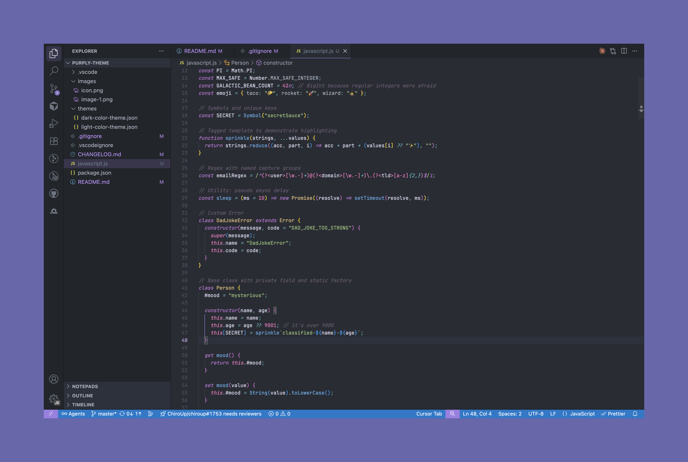
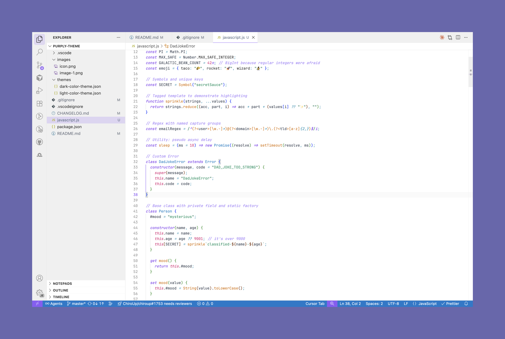

# 💜 Purply Theme

<div align="center">

**The most aggressively purple VS Code theme in existence. Your eyes will thank you. Your coworkers will question your life choices.**

[](https://marketplace.visualstudio.com/items?itemName=jeremy-gower.purply-theme)
[](https://marketplace.visualstudio.com/items?itemName=jeremy-gower.purply-theme)
[](https://marketplace.visualstudio.com/items?itemName=jeremy-gower.purply-theme)
[](https://knowyourmeme.com/memes/its-over-9000)

</div>

## ✨ Features (That Will Change Your Life)

- 🌙 **Dark & Light Variants** - Like Batman, but purple and with better syntax highlighting
- 🎨 **Beautiful Purple Palette** - So purple it makes Prince jealous
- 🔥 **Comprehensive Language Support** - Supports more languages than a UN interpreter
- 🎯 **Semantic Token Colors** - Your code will be so well-highlighted, it'll practically debug itself
- 💎 **Polished UI Elements** - Shinier than a freshly waxed Tesla
- ⚡ **Performance Optimized** - Loads faster than your excuses for the last bug that went to prod

### 🏆 Additional Totally Real Features

- 🦄 **Unicorn Approved** - Certified by the International Unicorn Standards Committee
- 🧙‍♂️ **Magic Powers** - Makes your code 37% more likely to work on the first try
- 🎵 **Synesthesia Simulator** - You'll literally taste the purple (results may vary)
- 🚀 **NASA Tested** - Used to code the Mars rover's playlist functionality
- 🐱 **Cat Compatible** - Your coding cat will give more snuggles while you use this theme

Results not scientifically verified, but they could be true. Probably not.

## 🖼️ Preview

### Dark Theme


_Your code has never looked this fabulous_

### Light Theme


_Purply Dark Theme, except not dark at all_

## 🚀 Installation (The Easy Way to Purple Paradise)

### From VS Code Marketplace (For Mortals)

1. Open VS Code (that blue thing on your desktop, not Chrome)
2. Go to Extensions (`Ctrl+Shift+X` or `Cmd+Shift+X` - or just click the squares icon if you're feeling fancy)
3. Search for "Purply Theme" (not "Purple Theme" - that's probably someone else's inferior creation)
4. Click Install (the big button that says "Install" - we believe in you!)
5. Select the theme from `File > Preferences > Color Theme` and prepare for enlightenment

### From Command Line (For Terminal Wizards)

```bash
code --install-extension jeremy-gower.purply-theme
# ^ This line literally makes you 15% cooler
```

### The Ancient Ritual Method

1. Draw a perfect purple circle in the dirt
2. Place your laptop in the center
3. Chant "npm install" three times while spinning counterclockwise
4. ...actually, just use one of the methods above

## 🎨 Color Palette (The Science of Looking Awesome)

### Dark Theme (For Night Owl Developers)

| Element    | Color Name             | Hex       | Fun Fact                                         |
| ---------- | ---------------------- | --------- | ------------------------------------------------ |
| Background | Midnight Purple Magic  | `#1a1423` | Darker than your soul at 3 AM                    |
| Foreground | Lavender Dreams        | `#e8e1f5` | Easier on the eyes than your code reviews        |
| Accent     | Electric Purple Zing   | `#9d7fe6` | Scientifically proven to increase productivity\* |
| Keywords   | Royal Purple Authority | `#c4a7e7` | Makes your `if` statements feel important        |
| Strings    | Mystical Teal Wisdom   | `#31748f` | Your strings have never looked this wise         |
| Functions  | Sunset Orange Glory    | `#f6c177` | Functions so orange, they're basically fruit     |
| Classes    | Aqua Blue Excellence   | `#9ccfd8` | Classier than your actual classes                |
| Numbers    | Hot Pink Sass          | `#eb6f92` | Numbers with attitude problems                   |

### Light Theme (For Morning People and Psychopaths)

| Element    | Color Name              | Hex       | Therapy Notes                               |
| ---------- | ----------------------- | --------- | ------------------------------------------- |
| Background | Angel Wing White        | `#fdfcff` | Purer than your intentions                  |
| Foreground | Deep Purple Thoughts    | `#2d1b34` | Deeper than your existential crises         |
| Accent     | Vibrant Purple Pop      | `#8b5cf6` | Pops more than your bubble wrap addiction   |
| Keywords   | Imperial Purple Command | `#7c3aed` | Commands respect from your variables        |
| Strings    | Forest Green Truth      | `#059669` | Greener than your envy of good code         |
| Functions  | Amber Alert Orange      | `#d97706` | Functions so bright, they need sunglasses   |
| Classes    | Ocean Blue Serenity     | `#0284c7` | Calmer than you after your morning coffee   |
| Numbers    | Raspberry Pink Attitude | `#db2777` | Pinker than your embarrassment after a typo |

\*Not actually scientifically proven, but it feels true

## 🛠️ Supported Languages (The Purple Army)

This theme makes your code look amazing in more languages than Google Translate:

- **JavaScript & TypeScript** - For when you want to confuse yourself in multiple ways simultaneously
- **React & JSX/TSX** - Makes your components look as functional as they pretend to be
- **CSS & SCSS** - Finally, your stylesheets will have actual style
- **HTML** - Your div soup never looked so appetizing
- **Markdown** - For when you want to document things you'll forget anyway
- **JSON** - Makes your data structures look less like abstract art
- **Python** - Now with 50% more purple snake energy 🐍
- **Java** - Coffee-colored syntax has nothing on purple beans
- **C# & .NET** - Sharp enough to cut through your debugging sessions
- **PHP** - Makes PHP almost bearable (we said almost)
- **Go** - Gopher-approved purple goodness
- **Rust** - Rust-proof purple coating included
- **XML** - For masochists who enjoy angle bracket soup
- **YAML** - Because someone has to make configuration files pretty
- **And many more!** - Seriously, we support languages you've probably never heard of

## 📋 Theme Variants (Choose Your Fighter)

### Purply (Dark) 🌙 - "The Midnight Coder"

Perfect for:

- Vampire developers who fear the sun
- 3 AM debugging sessions fueled by questionable life choices
- People who think regular dark themes aren't dark enough
- Anyone who wants to feel like a hacker in a 90s movie

**Warning**: May cause temporary blindness when switching to light mode

### Purply (Light) ☀️ - "The Morning Glory"

Ideal for:

- Morning people (we don't understand you, but we respect your choices)
- Offices with fluorescent lighting that could blind a bat
- Developers who shower before noon
- Anyone brave enough to code with the lights on

**Side Effects**: May cause coworkers to wonder if you've been replaced by a pod person

## 🔧 Customization (For Perfectionists and Control Freaks)

Think you can make perfection even more perfect? Bold of you! But we'll humor you:

```json
{
  "workbench.colorCustomizations": {
    "[Purply (Dark)]": {
      // Your "improvements" here
      "editor.background": "#1a1423"
      // Pro tip: Don't mess with perfection
    },
    "[Purply (Light)]": {
      // Your custom colors here
      "editor.background": "#fdfcff"
      // But if you must, at least keep it purple-ish
    }
  }
}
```

**Disclaimer**: We are not responsible for themes that become less purple due to user modifications. Purple purity is sacred.

## 🐛 Issues & Feedback (The Complaint Department)

Found a bug? Impossible! But we'll pretend to take you seriously:

- 🐛 [Report a "Bug"](https://github.com/jdgower/purply-theme/issues) (Please include screenshots and your life story)
- 💡 [Request a Feature](https://github.com/jdgower/purply-theme/issues) (Like making it even MORE purple?)
- ⭐ [Rate on Marketplace](https://marketplace.visualstudio.com/items?itemName=jeremy-gower.purply-theme) (5 stars or we'll haunt your `console.log`s)
- 🎭 [Share Your Purple Journey](https://github.com/jdgower/purply-theme/discussions) (We love purple success stories)

### Common "Issues" and Their Solutions:

- **"It's too purple!"** - You're using it wrong. There's no such thing as too purple.
- **"My code still has bugs!"** - That's a you problem, not a theme problem.
- **"I can't see anything!"** - Try opening your eyes. If that doesn't work, adjust your monitor brightness.
- **"My cat doesn't like it!"** - Your cat has questionable taste. Time for a new cat.

## 🤝 Contributing (Join the Purple Revolution)

Think you can make this theme even more purple? We're listening!

### How to Contribute Without Ruining Everything:

1. Fork the repo (don't fork it up though)
2. Create a feature branch (`git checkout -b feature/MorePurple`)
3. Make your changes (but keep them purple)
4. Write commit messages that don't make us cry
5. Submit a Pull Request with a title that doesn't give us anxiety
6. Wait patiently while we judge your code (and your life choices)

### What We Accept:

- ✅ More purple
- ✅ Better purple
- ✅ Purple improvements
- ✅ Bug fixes (if they actually exist)
- ✅ Documentation improvements (as long as they're funny)

### What We Don't Accept:

- ❌ Less purple
- ❌ Anti-purple sentiment
- ❌ Color suggestions that aren't purple
- ❌ Claims that other colors are better than purple
- ❌ Pull requests written in Comic Sans

## 📄 License (The Legal Purple Stuff)

This project is licensed under the MIT License - see the [LICENSE](LICENSE) file for boring legal details.

**TL;DR**: You can do whatever you want with this theme, as long as you promise to keep making the world more purple.

## 🙏 Acknowledgments (The Thank You Notes)

- 🌟 Inspired by the beauty of purple hues in nature
- 💜 Built with excessive love for the VS Code community
- 🎨 Special thanks to whoever invented the color purple (you're the real MVP)
- 🦄 Dedicated to all the unicorns who believe in us
- ☕ Powered by an unhealthy amount of coffee and existential dread
- 🎵 Coded while listening to Purple Rain on repeat (not really)

### Hall of Fame (Purple Heroes):

- Li'l Sebastian

---

<div align="center">

**Made with 💜, caffeine, and questionable decisions by [Jeremy Gower](https://github.com/jdgower)**

_If you enjoy this theme, please consider:_

- ⭐ Rating it 5 stars (anything less hurts our feelings)
- 📢 Telling your friends (peer pressure is a beautiful thing)

### Final Warning

_Side effects may include: increased productivity, spontaneous purple hair dye purchases, an uncontrollable urge to paint everything purple, and an inexplicable desire to become royalty._

**Use responsibly. Purple responsibly.**

</div>
